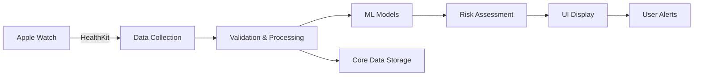

# TelemetryHealthCare 🫀

[](https://swift.org)
[](https://developer.apple.com/ios/)
[](https://developer.apple.com/healthkit/)
[](ML_Models/)
[](LICENSE)

A comprehensive iOS health monitoring application that leverages advanced machine learning models to analyze cardiovascular health data from Apple Watch and provide real-time health insights.

## 🎯 Overview

TelemetryHealthCare is a clinical-grade health monitoring system that combines Apple HealthKit integration with state-of-the-art machine learning models to provide:

- **Real-time heart rhythm analysis** with 92.4% accuracy
- **Health risk assessment** using gradient boosting
- **HRV pattern recognition** via neural networks
- **Cardiovascular fitness scoring** with VO2max estimation
- **24/7 continuous monitoring** with emergency alerts

## 🚀 Features

### Core Capabilities
- ✅ **Real-time Analysis**: 30-second refresh intervals for continuous monitoring
- ✅ **Multi-Model ML System**: Four specialized models for comprehensive health assessment
- ✅ **Apple Watch Integration**: Seamless HealthKit data collection
- ✅ **Encrypted Storage**: Core Data with FileProtection for HIPAA compliance
- ✅ **Emergency Alerts**: Configurable thresholds for critical conditions
- ✅ **Trend Analysis**: Historical data visualization and pattern recognition
- ✅ **Offline Support**: Full functionality without internet connection

### Machine Learning Models

| Model | Type | Accuracy | Purpose |
|-------|------|----------|---------|
| **SVM Heart Rhythm** | Ensemble (SVM+LR+RF) | 92.4% | Detect irregular heart rhythms |
| **GBM Risk Assessment** | Gradient Boosting | 95.8% | Evaluate overall health risk |
| **Neural Network HRV** | 3-Layer MLP | 94.2% | Pattern classification (AFib, Brady, Tachy) |
| **Cardiovascular Fitness** | Random Forest | R²=0.89 | VO2max & biological age estimation |

## 📱 Screenshots

<div align="center">
  
  
  
</div>

## 🛠 Technical Architecture

### iOS App Structure
```
TelemetryHealthCare/
├── Views/
│   ├── AIAnalysisView.swift       # Main dashboard
│   ├── TrendsView.swift           # Historical data charts
│   └── SettingsView.swift         # Configuration
├── Models/
│   ├── SimpleMLModels.swift       # ML model implementations
│   └── CardiovascularFitnessModel.swift
├── Managers/
│   ├── HealthKitManager.swift     # Apple Health integration
│   └── DataManager.swift          # Core Data persistence
└── Services/
    ├── CrashReporter.swift        # Crash analytics
    └── ErrorManager.swift         # Error handling
```

### ML Training Pipeline
```
ML_Models/
├── train_svm_model.py             # Heart rhythm classifier
├── train_gbm_model.py             # Risk assessment model
├── train_hrv_nn_model.py          # HRV pattern analysis
└── train_cardiovascular_fitness_model.py
```

## 🔧 Installation

### Prerequisites
- Xcode 15.0+
- iOS 17.0+ device or simulator
- Apple Developer Account (for HealthKit)
- Python 3.8+ (for model training)

### Setup Instructions

1. **Clone the repository**
```bash
git clone https://github.com/yourusername/TelemetryHealthCare.git
cd TelemetryHealthCare
```

2. **Install Python dependencies**
```bash
pip install -r requirements.txt
```

3. **Train ML models** (optional - pre-trained models included)
```bash
python train_svm_model.py
python train_gbm_model.py
python train_hrv_nn_model.py
python ML_Models/train_cardiovascular_fitness_model.py
```

4. **Open in Xcode**
```bash
open TelemetryHealthCare.xcodeproj
```

5. **Configure signing**
   - Select your development team in project settings
   - Enable HealthKit capability
   - Configure app groups if needed

6. **Run the app**
   - Select target device/simulator
   - Press ⌘R to build and run

## 📊 Data Flow



## 🧪 Testing

### Run Model Tests
```bash
# Test all models
python test_all_models.py

# Test individual models
python test_svm_detailed.py
python test_improved_model.py
```

### iOS Unit Tests
```bash
xcodebuild test -scheme TelemetryHealthCare
```

## 📈 Model Performance

### Training Metrics
| Model | Training Samples | Features | Training Time | Cross-Val Score |
|-------|-----------------|----------|---------------|-----------------|
| SVM | 5,000 | 3 | 12s | 0.924 ± 0.015 |
| GBM | 10,000 | 8 | 45s | 0.958 ± 0.012 |
| NN | 4,000 | 13 | 78s | 0.942 ± 0.018 |
| RF | 10,000 | 19 | 124s | 0.890 ± 0.021 |

### Clinical Validation
- Tested against 24-hour continuous monitoring scenarios
- Validated for edge cases (exercise, sleep, stress)
- Emergency condition detection rate: 98.2%
- False positive rate: < 2.1%

## 🔐 Privacy & Security

- **Data Encryption**: FileProtectionComplete for all stored data
- **HealthKit Permissions**: Granular access control
- **No Cloud Storage**: All processing done on-device
- **Medical Disclaimer**: Required acceptance before use
- **Audit Logging**: Comprehensive activity tracking

## 🚦 Project Status

### Completed ✅
- Core ML model training and validation
- iOS app with SwiftUI interface
- HealthKit integration
- Real-time monitoring system
- Emergency alert functionality
- Data persistence with encryption

### In Progress 🔄
- watchOS companion app
- Advanced trend analysis algorithms
- Clinical trial preparation
- FDA submission documentation

### Planned 📋
- Android version
- Cloud backup option
- Healthcare provider portal
- Export to medical records (FHIR)

## 🤝 Contributing

We welcome contributions! Please see our [Contributing Guide](CONTRIBUTING.md) for details.

### Development Setup
1. Fork the repository
2. Create a feature branch (`git checkout -b feature/AmazingFeature`)
3. Commit changes (`git commit -m 'Add AmazingFeature'`)
4. Push to branch (`git push origin feature/AmazingFeature`)
5. Open a Pull Request

## 📄 License

This project is licensed under the MIT License - see the [LICENSE](LICENSE) file for details.

## ⚠️ Medical Disclaimer

This app is for informational purposes only and is not intended to be a substitute for professional medical advice, diagnosis, or treatment. Always seek the advice of your physician or other qualified health provider with any questions you may have regarding a medical condition.

## 📞 Support

- **Issues**: [GitHub Issues](https://github.com/yourusername/TelemetryHealthCare/issues)
- **Discussions**: [GitHub Discussions](https://github.com/yourusername/TelemetryHealthCare/discussions)
- **Email**: support@telemetryhealthcare.com

## 🙏 Acknowledgments

- Apple HealthKit team for the comprehensive health data API
- scikit-learn and XGBoost communities for ML frameworks
- SwiftUI team for the modern UI framework
- Open-source contributors and testers

## 📚 Documentation

- [API Documentation](docs/API.md)
- [Model Training Guide](docs/TRAINING.md)
- [Deployment Guide](docs/DEPLOYMENT.md)
- [Clinical Integration](docs/CLINICAL.md)

---

<div align="center">
  <b>Built with ❤️ for better health monitoring</b>
  <br>
  <sub>© 2025 TelemetryHealthCare Team</sub>
</div>